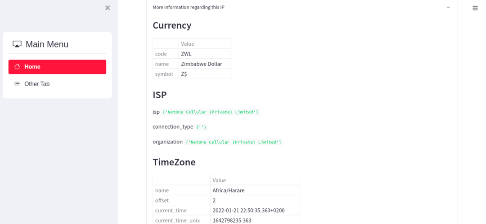

# Geolocation-App-Python-Streamlit-Folium
This is an app to find Geo Location data based on the IP address of the device

Streamlit is an open-source 
Python library that makes it easy to create and share beautiful,
custom web apps for machine learning and data science. In just a few minutes you can build and deploy powerful data apps.
[Streamlit Docs](https://docs.streamlit.io/library/get-started)

The App uses [IP GEO LOCATION](https://app.ipgeolocation.io/) to get the IP info of the device. Go to the URL and generate the free [API_KEY](https://app.ipgeolocation.io/). `Note : This app will not work without this API KEY`

This project also make use of folium.[Folium](https://python-visualization.github.io/folium/) is a powerful Python library that helps you create several types of Leaflet maps. By default, Folium creates a map in a separate HTML file. Since Folium results are interactive, this library is very useful for dashboard building.

#### To install relevant packages
Open your shell or terminal and install the relevant packages using the command below

```python
pip install -r requirements.txt
```

#### To run this Application
Open the root folder of the project and run the command below:
```python
streamlit run main.py
```

#### Dashboard Example: 


